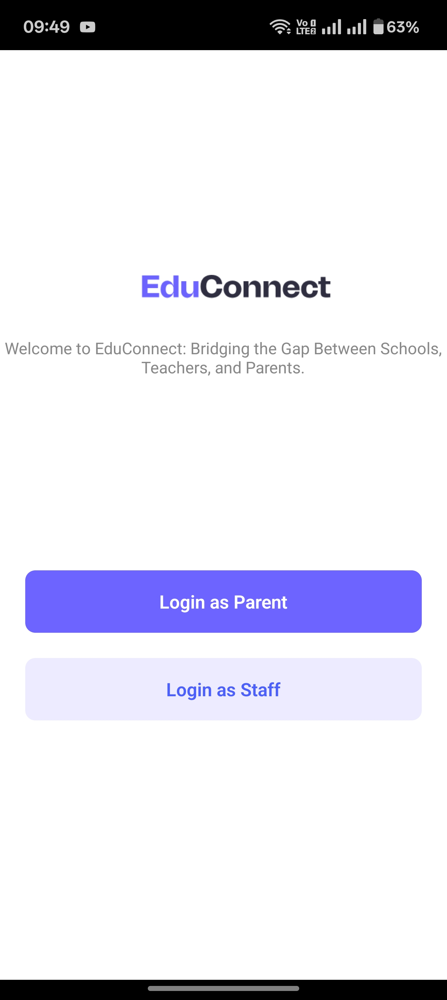

# 🎓 EduManage – React Native UI Project

A **React Native** project designed to explore UI development by building a student management app.

---

## 📱 Screenshots

<div align="center">
  <table>
    <tr>
      <td></td>
      <td></td>
      <td></td>
    </tr>
    <tr>
      <td></td>
      <td></td>
      <td></td>
    </tr>
  </table>
</div>

> _All screenshots are stored inside the `screenshots/` folder._

---

## 🚀 Getting Started

### Prerequisites

- Node.js (v16+)
- Yarn or npm
- Android Studio or Xcode with emulators set up
- Follow the official [React Native Environment Setup](https://reactnative.dev/docs/environment-setup)

### Installation

```bash
git clone https://github.com/shivamsharma-1996/EduManage-React-Native.git
cd EduManage-React-Native
yarn install
